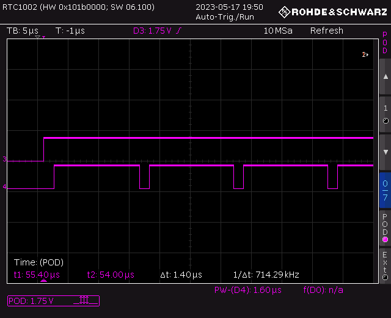

Encryption time test
====================

This is a test application to measure the execution time of
sd_ecb_block_encrypt()

It is a temporary repository during an open ticket with nordic semiconductor

Compile
=======

Download and extract `nRF5_SDK_17.0.2_d674dde.zip` into
`vendor/nRF5_SDK_17.0.2_d674dde`

Compile using:

```
make
```

Flash
=====

To flash an nrf52840-dk, type:

```
make flash
```

Make sure it's not on app protect is off. It will flash both softdevice and app.

Test
====

Hook up an osciloscope probe to the pins P0.13 for sync signal and P0.12 for
timing measurements.

Set trigger on P0.13
Measure pulse width on P0.12

A difference in exeuction time is noticed when running GDB against the device.

Currently, signal 3 is connected to sync, signal 4 is connected to timing. No
settings have been changed on oscilloscope.

After running:
```
make flash
```


Then connecting with gdb (via pyocd):
(using setup in https://github.com/pengi/gdb_pyocd_integration )
```
Typing:
$ gdb-multiarch encryption_time-nrf52840.elf
...
(gdb) nrf1
(gdb) connect
...
(gdb) res
Resetting target with halt
Successfully halted device on reset
(gdb) c
Continuing.
```



Then disconnecting gdb results in:
```
pressing: ctrl-C
^C[New Thread 536888368]
[New Thread 536888024]
[New Thread 536883824]
[New Thread 536889376]
[New Thread 536881408]

Thread 2 "IDLE" received signal SIGINT, Interrupt.
[Switching to Thread 536888368]
0x000286a4 in prvCheckTasksWaitingTermination () at vendor/nRF5_SDK_17.0.2_d674dde/external/freertos/source/tasks.c:3479
3479                    while( uxDeletedTasksWaitingCleanUp > ( UBaseType_t ) 0U )
(gdb) exit
A debugging session is active.

        Inferior 1 [Remote target] will be detached.

Quit anyway? (y or n) y
Detaching from program: /home/max/src/freertos-nrf-encrypt-timings/encryption_time-nrf52840.elf, Remote target
0119945 I Client detached [gdbserver]
Ending remote debugging.
0119945 I Client disconnected from port 16963! [gdbserver]
[Inferior 1 (Remote target) detached]
```


